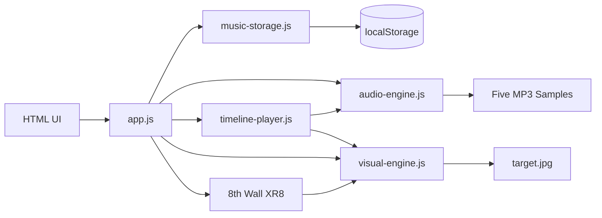

# Moon Rabbit Five Tones 技术实现方案

## 1. 文档说明

- 项目名称：Moon Rabbit Five Tones（月兔五音）
- 文档版本：1.0
- 对应代码：当前 `shuqiao-2026-rabbit-play-music` 工程
- 更新日期：2026-08-20

本文档描述当前已经落地的技术实现，覆盖音乐创作、本地保存、音频与视觉同步、8th Wall 图片目标识别、移动端适配、资源管理和构建发布。

## 2. 产品目标与边界

系统提供完整的移动端体验：

1. 用户通过二维码链接进入首页。
2. 用户使用宫、商、角、徵、羽五个琴键录制一个或多个 Take。
3. 作品保存到当前浏览器的 `localStorage`。
4. 用户进入 AR，相机识别月兔目标图后播放整首作品。
5. 每次重新识别目标时从头播放；目标丢失后立即停止并复位。

当前边界：

- 记录音符事件，不录制麦克风音频或视频。
- 不使用 GLB、GLTFLoader、ECS 或 A-Frame。
- 无后端、账号、上传和跨设备同步。
- 只保存同一来源、同一浏览器中的一个作品。
- 当前创作器只启用 FREE 自由节奏；数据结构仍兼容历史 `rhythm` 字段。
- AR 内容层只保留 `Edit music` 控件，不显示扫描卡片、状态文字或和鸣标题，避免遮挡识别目标。

## 3. 技术栈

| 层级 | 技术 | 用途 |
| --- | --- | --- |
| 页面与交互 | HTML、CSS、原生 JavaScript | 首页、Composer、AR 控件和移动端交互 |
| 3D 与视觉 | Three.js、GLSL Shader | 原画平面、扭曲、光效、粒子和波纹 |
| AR | 8th Wall Engine CameraPipelineModule | 相机、图片目标识别和目标姿态更新 |
| 音频 | Web Audio API | MP3 解码、缓存、叠加与提前调度 |
| 本地数据 | Web Storage API | 单作品和返回按钮位置持久化 |
| 构建 | Webpack 5 | JS 打包、HTML 生成、资源复制和开发服务 |

## 4. 工程结构

```text
src/
├── index.html          页面结构、视觉样式和响应式布局
├── app.js              应用入口、页面状态和业务流程编排
├── tones.js            五音配置、资源 URL 和公共常量
├── audio-engine.js     Web Audio 初始化、解锁、采样缓存与播放
├── timeline-player.js  多段时间线合并、音频调度与视觉事件派发
├── music-storage.js    本地作品创建、校验、读写与清理
├── visual-engine.js    Composer/AR 共用的 Three.js Shader 视觉引擎
└── assets/
    ├── poster.jpg
    ├── target.jpg
    └── moon_rabbit_five_tones_samples/

image-targets/
├── target.json         8th Wall 识别数据和目标尺寸信息
└── target_*.jpg        识别包相关图片

external/
├── xr/                 8th Wall XR Engine
├── xrextras/           XRExtras
└── landing-page/       8th Wall LandingPage 模块

config/
├── webpack.config.js
├── entry-plugin.js
└── asset-loader.js
```

模块职责原则：

- `app.js` 只负责流程编排和 DOM 状态，不实现底层音频解码或 Shader 算法。
- 音频、时间线、存储和视觉模块无自动启动副作用，由 `app.js` 显式实例化和调用。
- Composer 与 AR 使用同一个 `MoonRabbitVisual` 类，保证预览和最终效果一致。

## 5. 总体运行架构



应用使用 `body[data-view]` 管理三个互斥视图：

```text
home ── Create Music ──> composer
home ── View in AR ────> ar
composer ── Save & View in AR ──> ar
composer ── Back ──────> home
ar ── Edit music ──────> 页面重载后进入 composer
```

同一时刻只让一个主要视图接收事件。Composer 退出时销毁独立 WebGL Renderer；AR 返回 Composer 时停止 XR 并重载页面，确保相机流和两个 WebGL 上下文不会长期并行。

## 6. 五音资源与统一配置

五音的业务名称、符号、颜色、视觉冲击时长和 MP3 地址集中定义在 `src/tones.js`：

| 事件值 | 音名 | 唱名 | 音频文件 | 主视觉色 |
| --- | --- | --- | --- | --- |
| `gong` | 宫 | DO | `gong_C4.mp3` | 暖金 |
| `shang` | 商 | RE | `shang_D4.mp3` | 白金 |
| `jue` | 角 | MI | `jue_E4.mp3` | 青绿 |
| `zhi` | 徵 | SOL | `zhi_G4.mp3` | 赤金 |
| `yu` | 羽 | LA | `yu_A4.mp3` | 水蓝 |

关键常量：

```js
MAX_SEGMENT_MS = 30000
SEGMENT_GAP_MS = 300
RHYTHM_BPM = 90
```

`RHYTHM_BPM` 目前用于历史数据校验和 schema 固定值；当前 UI 不提供 RHYTHM 切换。

## 7. Composer 实现

### 7.1 录制模型

录制过程中维护以下内存状态：

```js
draftEvents       // 当前未保存 Take 的音符事件
draftElapsedMs    // 已累计且不包含暂停的时长
recording         // 是否正在录制
recordStartedAt   // 本次继续录制的 performance.now() 起点
selectedTakeId    // 当前选中的已保存 Take 或 draft
playingTakeId     // 当前试听的 Take、draft 或 all
```

用户点击琴键时：

1. 立即通过真实 MP3 试听该音。
2. 调用共享视觉引擎的 `trigger(tone)`。
3. 若当前处于录制状态，将 `{t, note}` 写入 `draftEvents`。
4. `t` 使用已累计时长加当前录制片段时长，因此暂停区间不会计入。
5. 事件时间被限制在 `0～30000ms`。

空 Take 不能保存。保存后生成新的 `MusicSegment`，持久化整个作品，并自动建立和选中一个新的 Current Take。

### 7.2 Take 交互

- 所有已保存 Take 和 Current Take 位于唯一允许横向滚动的 `#segment-list` 中。
- 当前选中卡片高亮，并在卡片内部显示操作按钮。
- 已保存 Take 提供 `Listen / Stop` 和 `Delete`。
- Current Take 提供 `Listen / Stop` 和 `Clear`。
- 卡片定位通过轨道自身的 `scrollTo({left})` 完成，不使用 `scrollIntoView()`，防止整个页面产生横向位移。
- `Start over` 和删除操作均要求用户确认。

### 7.3 页面布局

Composer 使用紧凑网格：

```text
┌──────────────────────────┐
│       Target Preview     │
├──────────────────────────┤
│  宫   商   角   徵   羽   │
├──────────────────────────┤
│ Record/Pause │ Save Take │
├──────────────────────────┤
│ Takes                 ...│
├──────────────────────────┤
│ Play Song │ Save & AR    │
└──────────────────────────┘
```

布局使用 `min-width: 0`、严格 `border-box`、安全区变量以及 `VisualViewport` 的真实宽高，避免 iPhone Safari 中 `width: 100% + padding` 导致整体右侧裁切。

## 8. 音频引擎与同步回放

### 8.1 AudioContext 解锁

移动 Safari 要求音频在可信用户手势中解锁。点击 Create、AR 或音频相关按钮时，`AudioEngine.unlock()` 会：

1. 创建或复用 `AudioContext`。
2. 播放一个静音 BufferSource。
3. 调用 `AudioContext.resume()`。

### 8.2 采样加载

`AudioEngine.load()` 并行获取五个 MP3，通过 `decodeAudioData()` 解码为 `AudioBuffer`，并缓存在 `Map<Tone, AudioBuffer>` 中。`loading` Promise 用于合并重复加载请求。

### 8.3 提前调度

`TimelinePlayer` 先把多个 Take 扁平化为单一时间线：

```text
全曲事件时间 = 前序 Take 时长总和 + 前序段间留白 + 当前事件 t
```

每段之间固定增加 300ms。播放以 `AudioContext.currentTime` 为统一时钟，并设置约 80ms 的启动缓冲：

```js
startAt = audio.currentTime + 0.08
audio.play(note, startAt + event.t / 1000)
```

音频源会一次性提前调度，因此同一时间的多个音符可以叠加。视觉侧在 `requestAnimationFrame` 中读取同一个音频时钟，并在事件到达时触发 Shader、粒子和回调，避免以多个 `setTimeout` 累积误差。

停止播放时会：

- 增加 `runId`，使旧动画循环自动失效。
- 取消当前动画帧。
- 停止并清空全部活跃 `AudioBufferSourceNode`。
- 按场景需要复位视觉状态。

## 9. 本地存储

作品键名：

```text
moon-rabbit-five-tones:v1
```

数据结构：

```ts
type Tone = 'gong' | 'shang' | 'jue' | 'zhi' | 'yu'

interface ToneEvent {
  t: number
  note: Tone
}

interface MusicSegment {
  id: string
  name: string
  mode: 'free' | 'rhythm'
  bpm: 90
  durationMs: number
  events: ToneEvent[]
}

interface LocalMusicWork {
  version: 1
  createdAt: number
  updatedAt: number
  segments: MusicSegment[]
}
```

`music-storage.js` 在读写两侧都执行清洗：

- 校验作品版本和数组结构。
- 过滤非法音名、非数字时间和空段。
- 将事件时间裁剪到 30 秒并排序。
- 限制 ID、名称和 duration。
- 不合法旧数据会被删除，并通过英文 Toast 告知用户。
- 没有任何非空段时不保留作品键，首页恢复为仅显示创作入口。

返回按钮位置单独保存在：

```text
moon-rabbit-composer-back-position:v1
```

其结构为 `{side: 'left' | 'right', yRatio: number}`，不影响音乐 schema。

## 10. 共享视觉引擎

### 10.1 原画平面

`MoonRabbitVisual` 使用 `target.jpg` 创建透明 `ShaderMaterial` 平面。纹理设置为 sRGB，使用线性过滤和 mipmap。

平面尺寸和中心偏移不采用硬编码比例，而是读取 `target.json`：

- `originalWidth / originalHeight`
- `width / height`
- `top / left`
- `isRotated`

`getTargetLayout()` 先根据 `isRotated` 还原横向正立尺寸，再以识别裁剪宽度归一化，计算完整原画的宽、高和相对识别区域中心的偏移。这使展示纹理能够覆盖完整目标图，同时保持与 8th Wall 返回姿态一致。

Fragment Shader 最终 alpha 在边缘做约 1.8% 羽化，降低数字平面与印刷图片之间的接缝。

### 10.2 五音 Shader 响应

Shader 使用两类权重：

- `uImpulseA / uImpulseB`：单次音符产生的短时冲击。
- `uWorldA / uWorldB`：每次触发增加 0.22、上限为 1 的持久累积状态。

各音主要表现：

- 宫：中心下沉、轻微压缩和暖金增亮。
- 商：横向扫弦、白金波纹。
- 角：中心旋转、上升和青绿能量。
- 徵：径向冲击、赤色高频震动和更强粒子爆发。
- 羽：蓝色水纹和下方云海流动。

短时权重使用攻击/衰减包络，并将多个同时事件的合成值限制在 1.35，避免连续点击造成无上限过曝。

### 10.3 粒子与波纹池

- 最大活跃粒子数：220。
- 复用波纹 Mesh 数：12。
- 粒子使用单个 `BufferGeometry + PointsMaterial`，每帧只更新 position、color 和 drawRange。
- 波纹循环复用，超时后隐藏，不持续创建 Geometry。
- Renderer DPR 限制为 2，控制高分辨率手机的填充压力。

### 10.4 最终和鸣

`TimelinePlayer` 使用 `Set` 记录本轮已播放的音名。当五种音首次全部出现时：

1. 调用 `visual.setHarmony(true)`。
2. 生成五色粒子和金色波纹。
3. Shader 中 `uHarmony` 平滑趋近 1，形成月轮与金色能量汇聚。

AR 中不显示 `Five Tones in Harmony` 或 `Moon Palace Awakened` 文字，只保留视觉效果，确保目标主体无遮挡。

## 11. 8th Wall AR 实现

### 11.1 延迟加载

首页不静态引入 AR 脚本。只有用户点击 `View in AR` 或 `Save & View in AR` 后才动态加载：

```text
external/xrextras/xrextras.js
external/landing-page/landing-page.js
external/xr/xr.js
```

`xr.js` 保留：

```html
data-preload-chunks="slam"
```

加载器以固定 DOM ID 保证每个脚本只注入一次，并通过 `window.XRExtras`、`window.LandingPage` 和 `window.XR8` 判断就绪状态。

延迟加载还有一个 UI 目的：XRExtras 会注入全局 CSS。只在 AR 阶段加载可以避免其通用样式污染 Composer。

### 11.2 CameraPipeline

AR 启动时配置：

```js
XR8.XrController.configure({
  imageTargetData: [IMAGE_TARGET_DATA],
  disableWorldTracking: true,
})
```

Pipeline 由以下模块组成：

- `XR8.GlTextureRenderer`
- `XR8.Threejs`
- `XR8.XrController`
- 可选 `LandingPage`
- 可选 `XRExtras.FullWindowCanvas`
- 可选 `XRExtras.Loading`
- 可选 `XRExtras.RuntimeError`
- 项目自定义 `moon-rabbit-five-tones` 模块

### 11.3 识别事件状态机

```text
imagefound
  ├─ 显示并更新视觉根节点姿态
  └─ 本次识别首次出现时，复位后播放整首一次

imageupdated
  └─ 仅更新 position / quaternion / scale，不重新播放

imagelost
  ├─ 停止所有已调度音源
  ├─ 重置 Shader、粒子、波纹和和鸣状态
  └─ 隐藏视觉根节点
```

`targetVisible` 用于区分连续姿态更新和重新获取目标，`targetPlaybackStarted` 防止同一次识别反复启动作品。

### 11.4 AR 界面

AR 相机画面上只保留右上角 `Edit music` 按钮，按钮最小触控高度为 44px，并避开 iPhone 安全区。编辑按钮会停止时间线和 XR 会话，通过 `sessionStorage` 标记重载后的目标页面，再回到 Composer。

## 12. iPhone 与移动端适配

### 12.1 盒模型与横向裁切

页面使用不可被 XRExtras 普通规则覆盖的严格盒模型：

```css
html {
  box-sizing: border-box !important;
}

*, *::before, *::after {
  box-sizing: inherit !important;
}
```

Composer 关键容器统一使用：

```css
width: 100%;
max-width: 100%;
min-width: 0;
```

整个页面禁止横向滚动；相机 Canvas 在非 AR 视图中使用 `display: none`，不参与页面宽度计算。

### 12.2 VisualViewport 与安全区

应用监听：

- `window.resize`
- `orientationchange`
- `visualViewport.resize`
- `visualViewport.scroll`

真实可视宽高写入 CSS 变量 `--app-width` 和 `--app-height`。刘海和 Home Indicator 使用 `env(safe-area-inset-*)` 计算，地址栏伸缩或旋转后重新约束 Composer 和悬浮返回按钮。

### 12.3 悬浮返回按钮

- 固定尺寸 52×52px。
- 位移超过 6px 才进入拖动，避免点击误判。
- 释放时吸附最近左右边缘。
- X/Y 坐标始终限制在安全区内。
- 保存吸附侧和纵向比例，旋转后重新计算绝对位置。

### 12.4 长按菜单

应用视图设置：

```css
-webkit-touch-callout: none;
-webkit-user-select: none;
user-select: none;
-webkit-user-drag: none;
```

JavaScript 同时阻止 `contextmenu`、`selectstart` 和 `dragstart`。不阻止全局 `touchstart`、`touchmove` 或 `pointerdown`，因此琴键点击、Take 横滑和返回按钮拖动仍可正常工作。

## 13. 生命周期与资源释放

| 场景 | 处理 |
| --- | --- |
| Composer 播放停止 | 停止全部音源、取消 RAF、恢复按钮状态 |
| Composer 关闭 | 停止播放并销毁独立 Visual Renderer |
| 进入 AR | 暂停录制、销毁 Composer WebGL 上下文、动态加载 AR |
| AR 目标丢失 | 停止音频、清空视觉状态、隐藏目标平面 |
| 页面进入后台 | 暂停录制和播放；AR 中同步复位目标 |
| AR 返回编辑 | 停止 XR8，然后重载并进入 Composer |
| Visual dispose | 释放材质、纹理副本、Geometry、Renderer 和监听器 |

共享纹理加载 Promise 只缓存原始纹理；每个 `MoonRabbitVisual` 使用 clone，销毁场景时不会误释放其他场景正在使用的实例。

## 14. 构建与发布

安装和构建：

```powershell
npm install
npm run build
```

本地开发：

```powershell
npm run serve
```

Webpack 输出到 `dist/`：

- `bundle.js`
- `index.html`
- `assets/`
- `image-targets/`
- `external/xr/`
- `external/xrextras/`
- `external/landing-page/`

`src/assets` 下的 ZIP 和 PSD 被排除，不进入生产目录。手机相机访问要求 HTTPS 安全来源；8th Wall Desktop App 默认测试入口为：

```text
http://localhost:58000/
```

## 15. 错误处理

- 音频不支持、采样加载失败或解码失败：捕获异常并显示英文 Toast。
- `localStorage` 数据损坏：删除无效作品并回退为空作品状态。
- 本地存储写入失败：恢复修改前的内存作品，避免 UI 显示已保存但实际未保存。
- XR 脚本、SLAM chunk 或相机启动失败：退出 AR、返回首页并显示权限/启动提示。
- XRExtras 与 LandingPage 为可选 Pipeline 工厂，模块不存在时不会把 `undefined` 添加到 Pipeline。

## 16. 验证清单

### Composer

- 首次进入时 target、五音键和底部按钮没有右侧裁切。
- 页面 `scrollWidth` 不大于真实可视宽度。
- Take 轨道可以横滑，但整个页面不能横滑。
- Record/Pause/Resume 不计入暂停时间。
- 空 Take 不能保存，单段不超过 30 秒。
- Listen/Stop/Delete/Clear 只显示在选中 Take 内。
- 长按文字、图片、Canvas 和按钮不出现网页上下文菜单。

### 音频与存储

- 首次可信点击后五个真实 MP3 均可播放。
- 快速点击和同时间事件可以叠加。
- 整曲按 Take 顺序播放，段间留白 300ms。
- 刷新后作品可恢复，非法作品会被清除。
- 删除最后一段后首页恢复无作品状态。

### AR

- 相机只在用户主动进入 AR 后申请。
- 识别平面方向、比例和中心偏移正确。
- `imageupdated` 不重复播放。
- `imagelost` 立即停止声音并复位。
- 再次 `imagefound` 从头播放一次。
- 五音齐全时只出现和鸣视觉，不显示遮挡文字。
- AR 画面只保留 `Edit music` 控件。

### 工程

- `npm run build` 成功。
- 生产源码不包含 GLB、GLTFLoader、Oscillator、ECS、A-Frame 或静态 `xr.js` 标签。
- ZIP、PSD 不复制到 `dist/assets`。

## 17. 后续扩展建议

如果后续需要继续扩展，建议保持现有模块边界：

- 新增音色：扩展 `tones.js`，并同步更新 Shader uniform 结构。
- 恢复节拍模式：在 Composer 层增加模式选择，并按 `RHYTHM_GRID_MS` 量化事件时间，不修改 TimelinePlayer。
- 多作品管理：提升存储版本，将单对象升级为作品索引和作品详情，但保留 Segment/Event schema。
- 云同步：在 `music-storage.js` 外增加 Repository 层，不让 UI 直接依赖远端接口。
- 性能分级：根据设备能力调整 DPR、粒子上限和 Shader 分支，不改变音乐事件模型。

